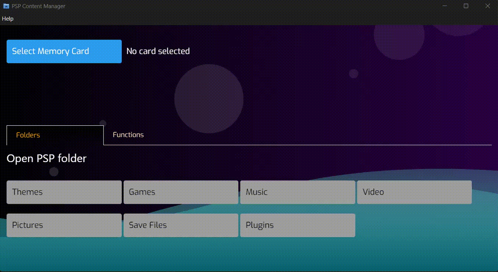

# Psp content manager

---

### Purpose

Simple utility application that allows:
- Instant folder navigation: instantly opening file explorer in root of target folder
- Folder structure creation: generation of the necessary directory tree for PSP files
- Extraction of specific files to their target destinations, such as ARK4, Chronoswitch and official sw updates
- Download of latest ARK4 and ChronoSwitch releases

---

#### Preview

#### [User manual](docs/USER_MANUAL.md)
#### [Dev manual](docs/DEV_MANUAL.md)

---

### Resources

I need to mention following sources, thanking them for their excellent documentation that made my life about 23% less miserable

[PSPunk](https://www.pspunk.com/)

[ARK4](https://github.com/PSP-Archive/ARK-4)

[ChronoSwitch](https://github.com/krazynez/Chronoswitch)